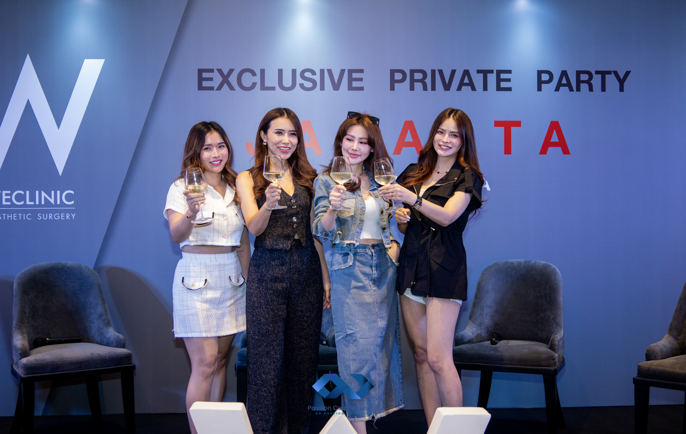
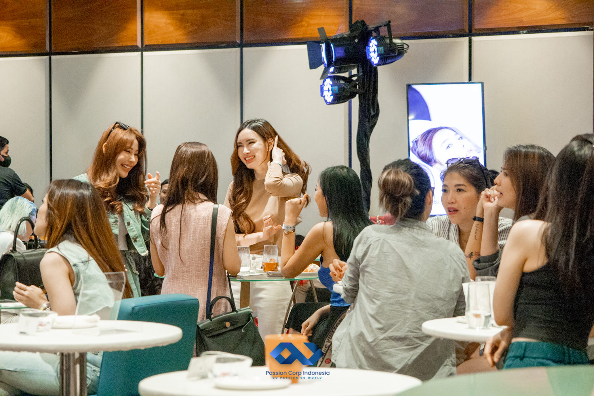

On January 21st, 2024, Passion Corp Indonesia had the honor of organizing an exclusive event for We Clinic, a renowned plastic surgery clinic from Bangkok. The We Clinic Afternoon Tea Party, held at the prestigious Swissôtel Jakarta PIK Avenue, brought together guests for an intimate and elegant gathering to discuss the latest trends in rhinoplasty and explore opportunities for international partnerships.

With growing interest in rhinoplasty and other cosmetic procedures in Southeast Asia, the We Clinic Afternoon Tea Party served as a platform for discussing these trends in an exclusive, relaxed setting. Dr. Sam and Dr. Da, the visionary owners of We Clinic, entrusted Passion Corp Indonesia with the responsibility of ensuring a flawless and memorable event. Our experienced team worked closely with the clinic's staff from the very beginning, fostering a strong and friendly relationship that paved the way for the event’s success.

The collaboration between our team and We Clinic's staff was seamless. From the early planning stages to the event’s completion, Passion Corp ensured that every detail was handled with care. Dr. Sam and Dr. Da expressed their satisfaction with the smooth execution and professional service, reflecting our commitment to exceeding client expectations.

## International Expertise and Local Understanding

At Passion Corp Indonesia, we pride ourselves on our ability to cater to the unique needs of international clients, such as We Clinic. This event not only highlighted our expertise in event organizing but also demonstrated our capacity to support clients in navigating cross-cultural nuances and local preferences. We ensured that the clinic’s high standards were met, blending international style with local hospitality to create an inviting atmosphere for all attendees.

As a trusted event organizer in Indonesia, Passion Corp Indonesia is here to provide end-to-end services for both local and international clients. Whether you’re planning a corporate seminar, an exclusive gathering, or a special event like We Clinic’s Afternoon Tea Party, we have the expertise to make it a success.

Contact us today for a [free consultation](https://passioncorp.id/kontakWA?redirect=https%3A%2F%2Fwa.me%2F6282311000310%3Ftext%3DHi%252C%2520Passion%2520Corp%2520Indonesia%252C%2520I%2520know%2520you%2520from%2520website%2520https%253A%252F%252Fpassioncorp.id%252F%2520%25E2%2580%259Cfree%2520consultation%25E2%2580%259D) and let’s start planning your next event!
