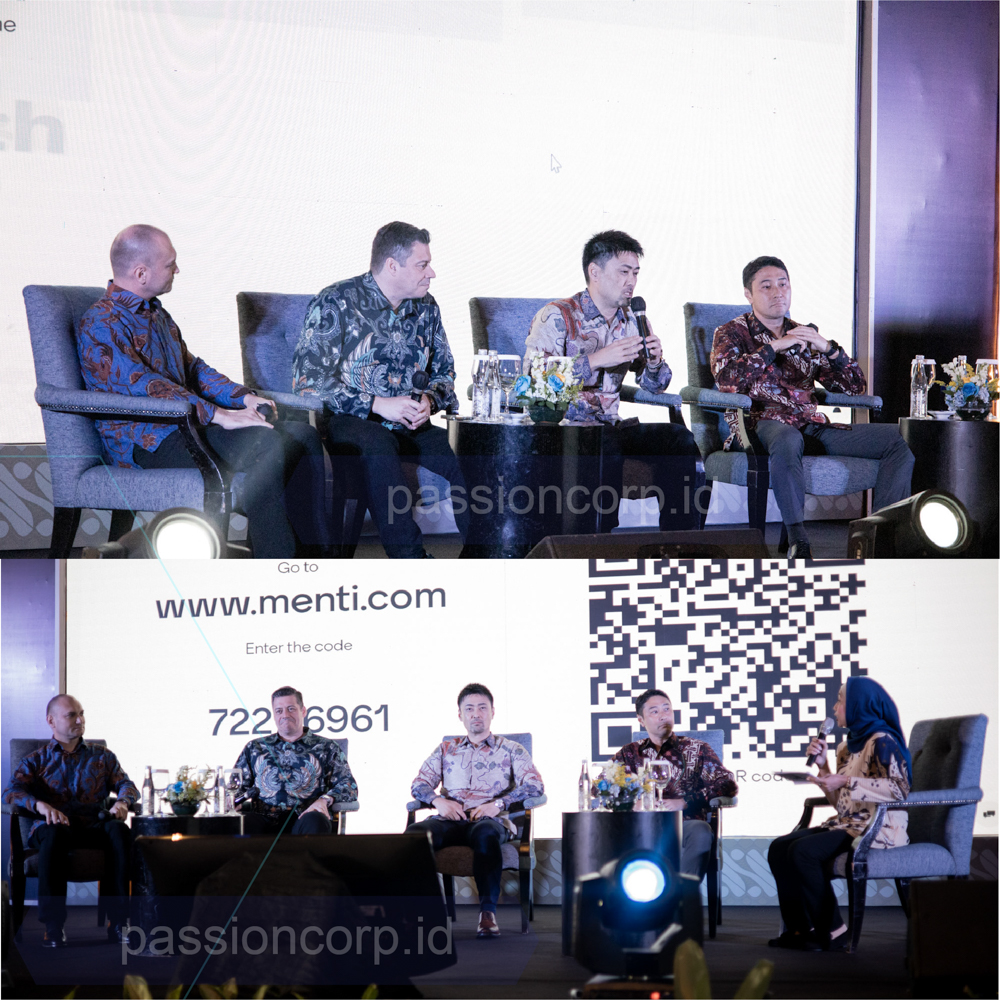
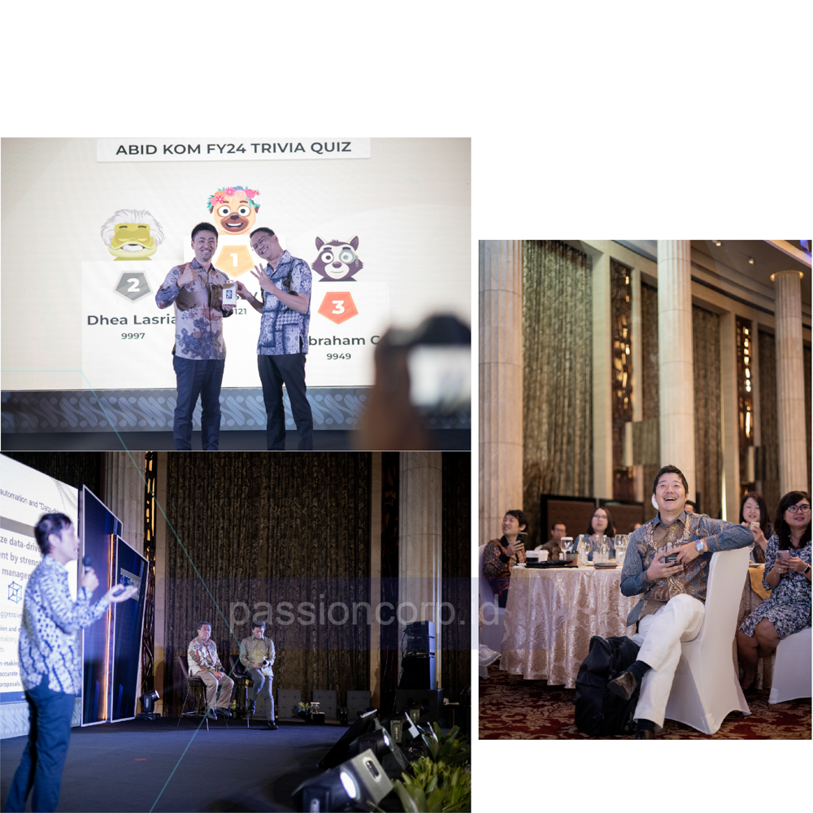
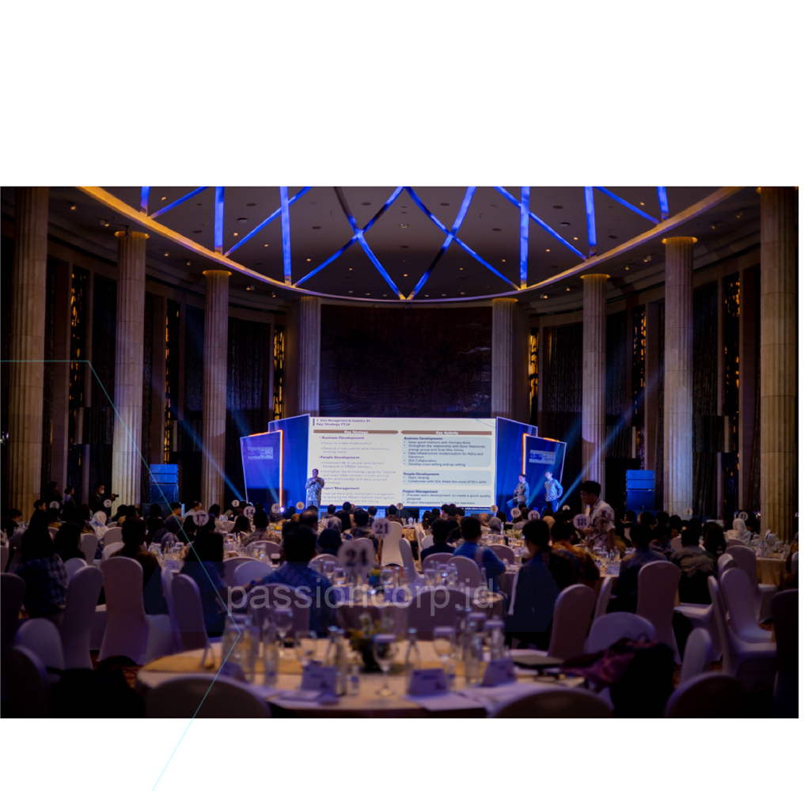
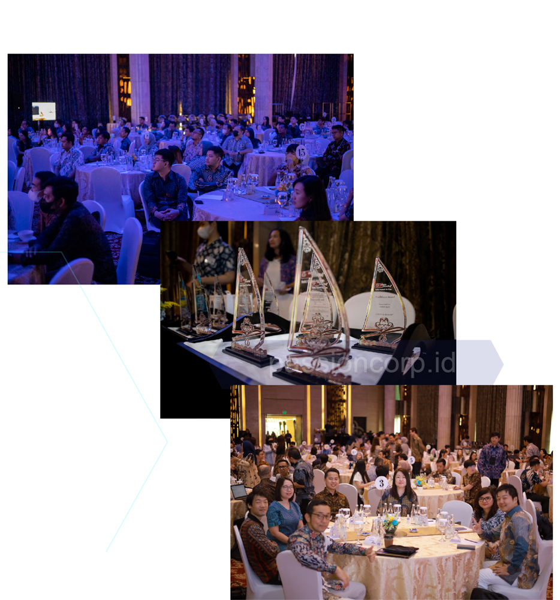

Emang boleh ya, sepercaya itu sama Event Organizer (EO)? Yuk, kita simak bareng-bareng sejauh mana manfaatnya berpartner dengan EO. Kita akan bahas apa aja sih yang bisa kamu dapat ketika memilih untuk bener-bener percaya dan bekerjasama dengan EO supaya acara yang kamu mau bisa terealisasikan. 

## Hemat Waktu dan Tenaga

Mengorganisir acara tentunya membutuhkan waktu dan energi yang banyak banget.  Dengan menggunakan jasa EO, kamu dapat menghemat waktu dan energi yang berharga, karena disini EO bakalan bantu kebutuhan acara yang kamu mau sampai beres!

## Punya Banyak Ide Kreatif

Udah pake EO tapi mikir sendiri buat konsep acaranya ? Yang bener aja, rugi dong ! 
Eitsss tenang aja. EO tugas nya ga cuma berjalan pas hari acara nya aja, mereka bakal bantu kamu bahkan dari pemikiran konsep acara, mereka punya ide-ide kreatif yang bisa ngebuat acaramu jadi beda dan gak biasa.

## Punya Jaringan Kerjasama Yang Luas

Sebagai sebuah Event organizer mereka pastinya  memiliki jaringan yang luas dengan vendor, Mereka dapat membantu mendapatkan penawaran terbaik untuk tempat, dekor, makanan, dan kebutuhan lainya yang bakal bikin acara kamu makin sukses.

## Atasi Masalah Secepat Flash

Ketika kita membuat acara pastinya ada tantangan tertentu yang kadang bisa menimbulkan sebuah masalah. Tapi tenang aja, sebagai Event organizer mereka memiliki pengalaman dalam menangani masalah-masalah yang mungkin muncul selama acara dengan cepat dan efisien, mereka bakal memastikan kelancaran acaramu.

## Ahli di Urusan Logistik

Mengurus logistik, termasuk transportasi, pengaturan tempat, dan mengelola peserta adalah salah satu keahlian EO. Mereka bisa merencanakan dan melaksanakan dengan cermat, sehingga semua aspek teknis terkendali.

Jadi, jawabannya boleh banget sepercaya itu sama EO! Kerjasama yang didasarkan pada kepercayaan bukan cuma bikin acara jadi seru, tapi juga membangun hubungan yang baik. Jadi, kalau kamu lagi mikirin gimana caranya bikin acara yang keren. Passion Corp Indonesia bisa jadi partner yang oke banget!

Sebagai pilihan terbaik, Passion Corp Indonesia hadir sebagai partner terbaik untuk menyelenggarakan acara kamu. Dengan kombinasi pengalaman yang mendalam, reputasi yang kuat, kreativitas yang tinggi, komunikasi yang efektif, manajemen proyek yang profesional, dan pemanfaatan teknologi terkini, Passion Corp Indonesia telah membuktikan dirinya sebagai Event Organizer Terbaik, Berpengalaman, dan Profesional. Mempercayakan acara Anda kepada Passion Corp Indonesia adalah langkah menuju kesuksesan acara yang luar biasa, baik di tingkat nasional maupun internasional.