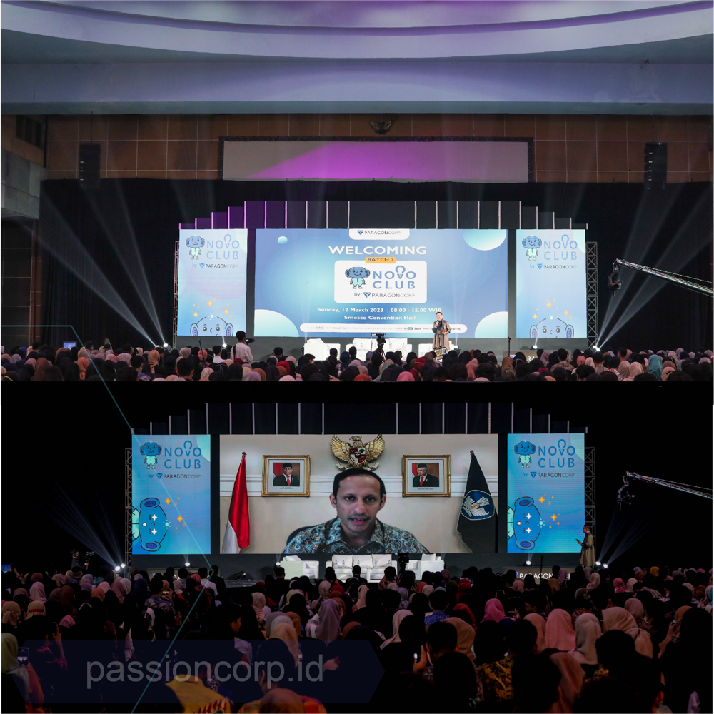
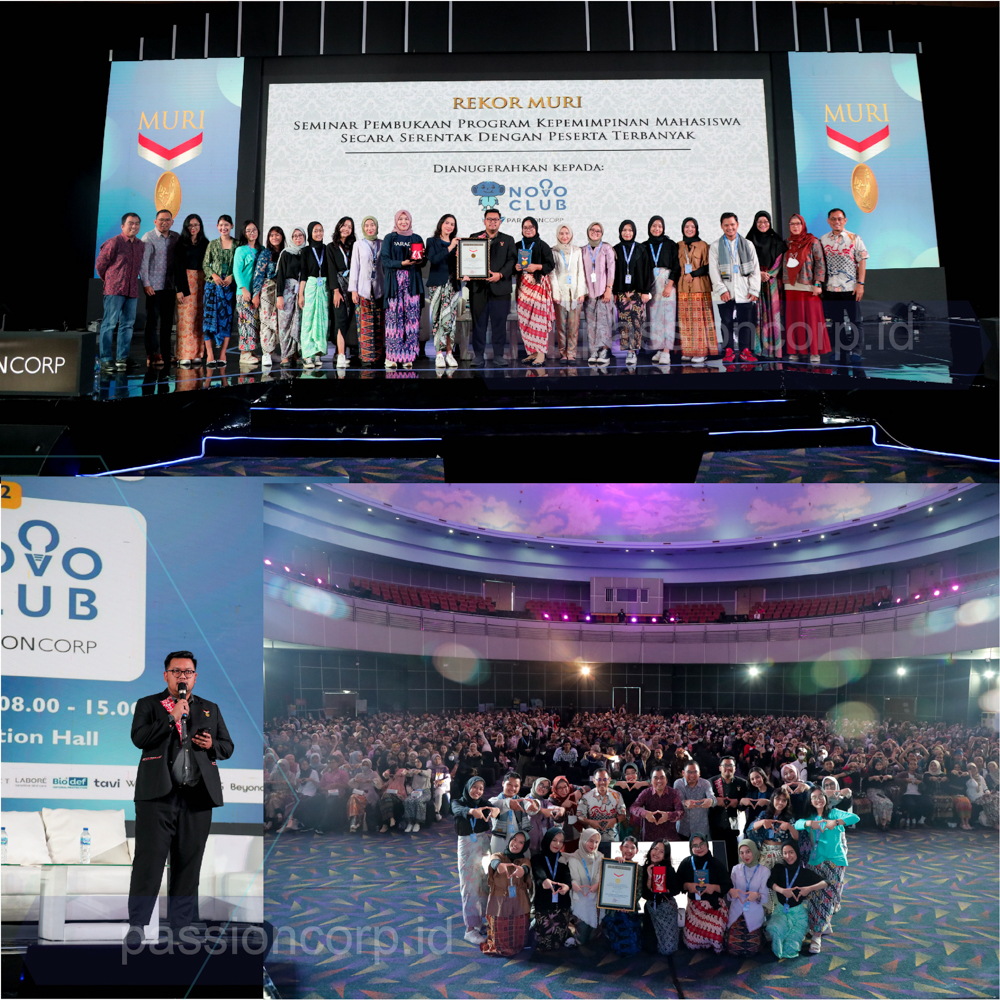
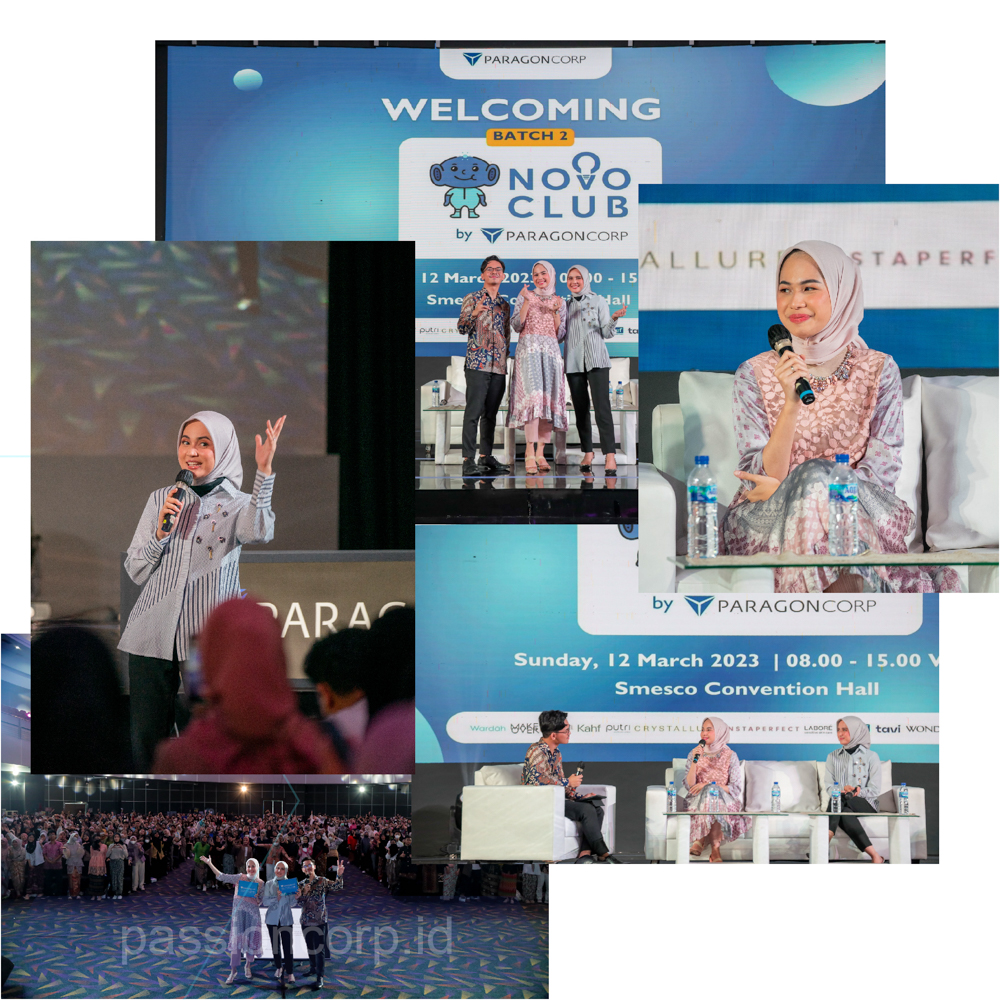
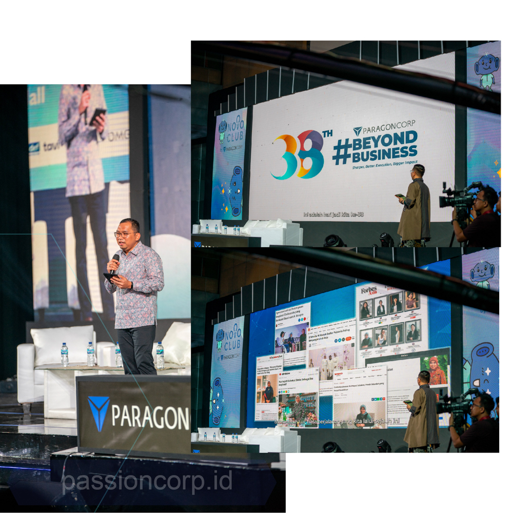

kamu lagi merencanakan sebuah acara dan ingin membuatnya dengan benar? Tapi bingung dari mana? nggak perlu cemas atau risau! Karena kamu berada di tempat yang tepat, karena Passion Corp Indoensia sebagai event organizer punya kumpulan tips sederhana yang pasti bisa bikin rencana event sukses banget.

Yuk, kita jelajahi bersama-sama bagaimana membuat rencana event menjadi semakin matang dan keren!

## Mulai Dari Ide Kreatif

Salah satu langkah pertama yang bisa kamu lakukan adalah memulai dari ide yang kreatif. Pikirkan konsep atau tema yang tidak umum, yang bisa membuat acaramu menjadi sorotan. Ide-ide kreatif ini bisa datang dari kegiatan-kegiatan yang kamu lakukan setiap hari, atau dari event-event yang sudah ada sebelumnya. Passion Corp Indonesia sebagai perancang event dengan ide kreatif punya tim tersendiri loh untuk ide-ide kreatif ini

## Rencanain Langkah Demi Langkah agar Semuanya Terorganisir

Rencanakan acaramu dengan detail, dan langkah per langkah. Dimulai dari persiapan awal, penentuan lokasi, konsep acara, hingga eksekusi pada hari-H. Dengan membuat rencana yang terstruktur, kamu dapat memastikan bahwa tidak ada yang terlewatkan dan semua berjalan sesuai dengan yang direncanakan.

## Pilih Tempat yang Pas Dan Sesuai

Pemilihan lokasi adalah kunci dari keberhasilan sebuah acara. Kamu harus pastikan tempat yang kamu pilih sesuai dengan konsep acaramu dan nyaman untuk para tamu. Pertimbangkan juga kapasitas, fasilitas, dan ketersediaan pendukung lainnya. Passion corp Indonesia menghadirkan divisi management venue agar kamu gak ribet-ribet lagi untuk cari lokasi yang cocok dengan konsep acara kamu. 

## Kenali Publikmu

Pahami siapa yang akan datang ke acaramu. Kenali preferensi dan kebutuhan audiens mu sehingga kamu bisa menyusun acara yang sesuai dan membuat mereka senang. Hal ini dapat membuat acara kamu jadi tak terlupakan.

## Pilih Waktu Yang Tepat

Pemilihan waktu acara tentunya jadi hal penting, kita  harus memperhatikan kenyamanan para peserta. Perhatikan juga durasi masing-masing segmen agar tidak terlalu panjang atau terlalu singkat. Ini akan membantu menjaga mood para peserta.

## Nyalakan Suasana Acaramu

Jangan takut untuk menambahkan sentuhan kreatif dalam setiap aspek acaramu. Mulai dari dekorasi, hingga hiburan atau aktivitas tambahan yang tidak menarik perhatian peserta . Sentuhan kreatif ini bisa menjadi elemen yang membuat acaramu berbeda dari yang lain.

## Urus Logistik dengan Cermat agar Tidak Ada Masalah Teknis

Logistik adalah bagian penting yang kadang sering diabaikan. Pastikan semuanya terorganisir dengan baik, termasuk transportasi, persiapan teknis, dan kebutuhan lainnya. Hal ini akan membantu acaramu berjalan dengan lancar tanpa hambatan.

## Abadikan Setiap Moment Acara

Pastikan kamu punya tim fotografer atau videografer yang dapat mendokumentasikan momen-momen berharga acaramu. Hasil dokumentasi yang baik bisa menjadi memori baru yang berharga dan bisa juga dijadikan portofolio mu untuk mempromosikan acara berikutnya.

## Evaluasi Setelah Acara

Setelah acara selesai, lakukan evaluasi mendalam bersama tim. Dengarkan feedback dari peserta dan tim pelaksana. Identifikasi apa yang berjalan dengan baik dan apa yang bisa ditingkatkan di acara berikutnya. Evaluasi ini dapat memberikan wawasan berharga untuk meningkatkan kualitas acaramu di masa depan.

Jadi, tunggu apalagi ?  Jangan takut untuk berkreasi bersama tim event organizer terbaik Passion Corp Indonesia, dan mulai rancang acara yang kamu mau. Atau kamu bisa bisa berpartner dengan kami passion corp indonesia sebagai jasa Event Organizer terbaik untuk memudahkan beban masalahmu.