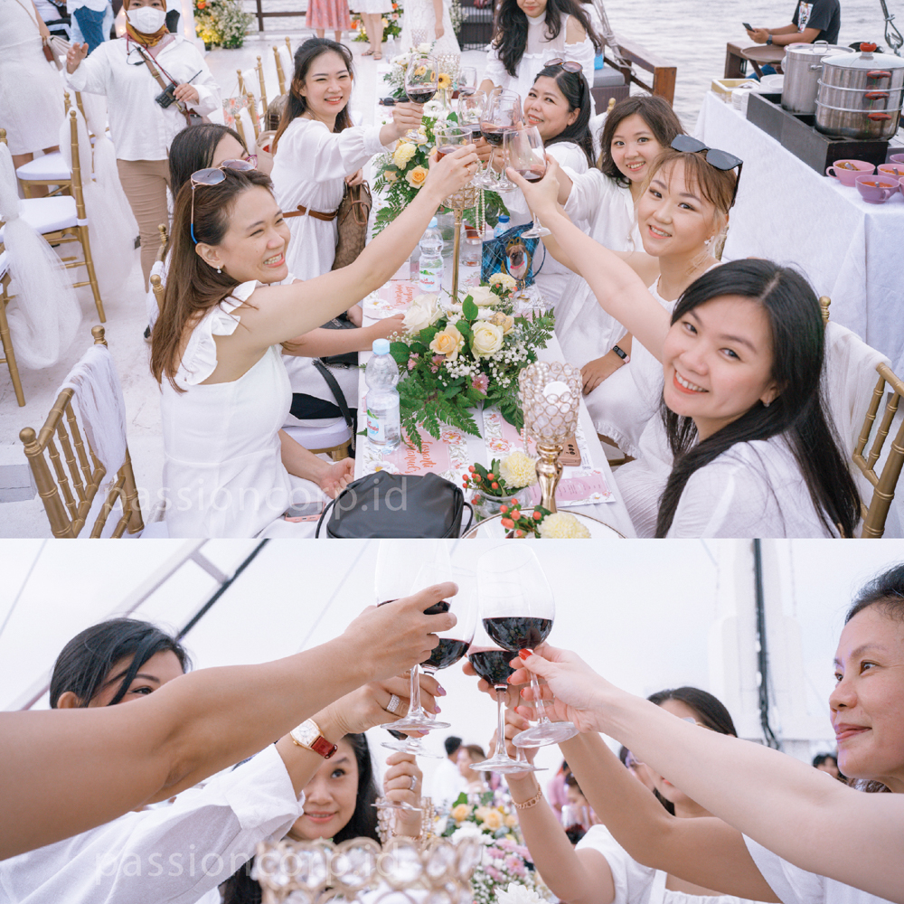
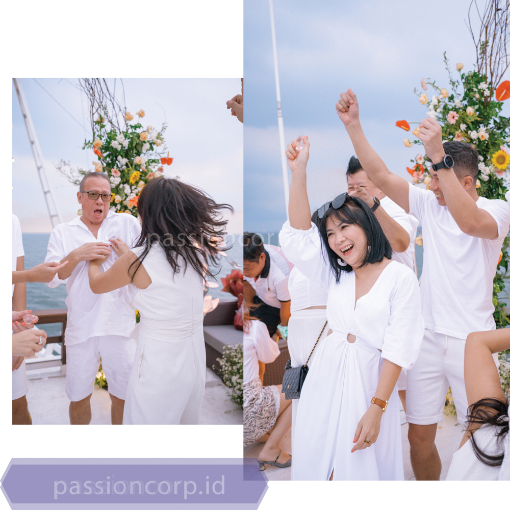
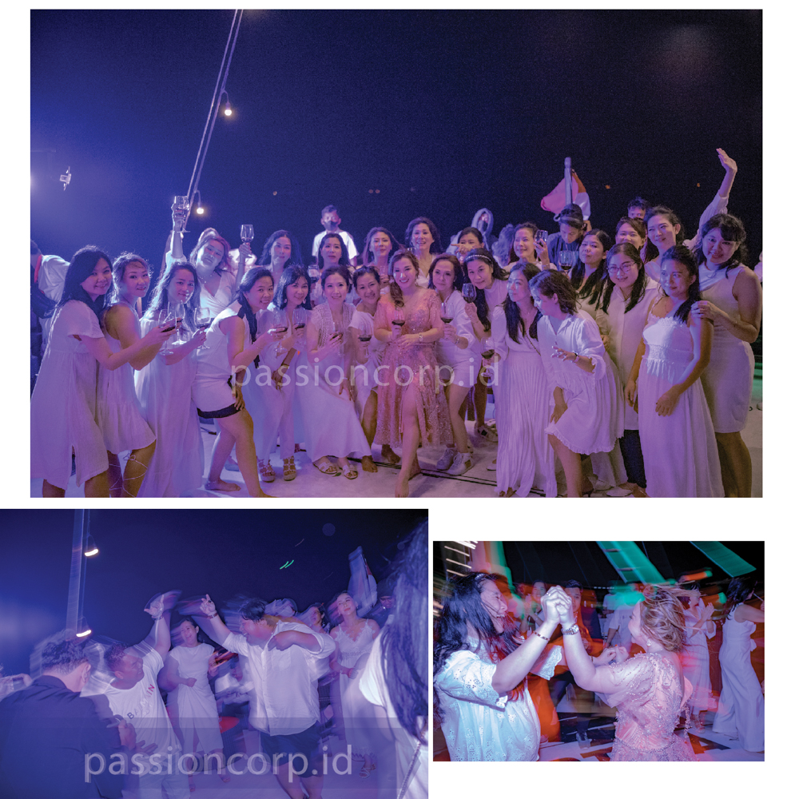
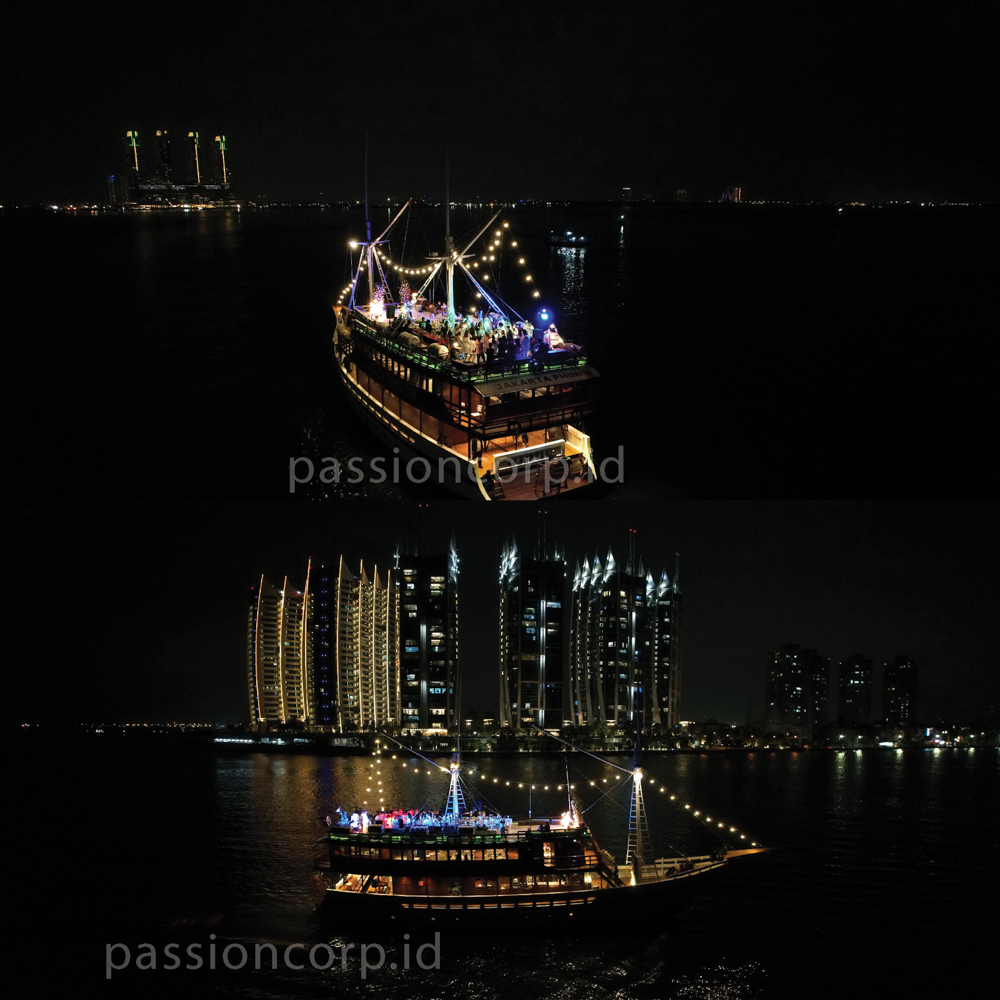

Pernah ga sih kamu membayangkan gimana kehidupan seorang event organizer (EO)? Nah, siapa sangka, di balik panggung gemerlap dan keberhasilan sebuah acara , ada cerita seru yang bisa bikin kamu jadi lebih deket ke dalam kehidupan Event Organizer. Yuk, let's go kita jelajahi bareng!

## Harus selalu siap siaga dengan ide kreatif yang unlimited

Di balik kesuksesan sebuah acara, EO dituntut untuk selalu punya ide. Mereka terus mengalirkan imajinasi mereka untuk menciptakan konsep-konsep acara yang unik dan keren. Pokoknya emang "si paling kreatif" deh mereka ini, walau Kadang  ide-ide itu bisa datang bagai hujan di musim panas, tapi gak jarang juga harus dicari sana-sini kayak mencari harta karun!. Passion Corp Indonesia dengan divisi kreatif nya sudah biasa loh menerima ide-ide gila yang kamu mau.

## Gak kenal social battery abis, karna dituntut untuk kenal banyak relasi

Salah satu kekuatan seorang EO adalah mereka punya jaringan yang luas. Mereka berinteraksi dengan berbagai pihak, mulai dari vendor, artis, hingga klien. Jadi gak kenal tuh sama social battery, harus selalu 3S  Senyum, Sopan, Santun. Walau begitu  dari sinilah seringkali muncul kesempatan-kesempatan tak terduga yang membuka pintu baru. manajemen tim yang baik , akan menghasilkan acara yang terbaik. Passion Corp Indonesia bukan hanya menghadirkan acara yang berkualitas, namun juga manajemen tim yang berkualitas. baik sebelum event, atau pun pasca event. 

## Harus siap siaga bagai ajudan negara

Setiap acara adalah tantangan besar yang harus dihadapi oleh seorang EO, semuanya harus dihadapi dengan sigap agar bisa memuaskan berbagai macam klien. Mulai dari mengatur persiapan hingga menghadapi masalah di lapangan, kadang bikin jantung deg deg an, semua itu harus dilewati dengan baik.

## Bisa jadi aktor handal demi keberlangsungan acara

Nggak jarang, di tengah-tengah persiapan atau berjalan nya acara, muncul berbagai masalah yang bikin pusing tujuh keliling. Mulai dari cuaca yang nggak mendukung, masalah teknis yang rumit, hingga perubahan mendadak dari klien. Tapi, seorang EO harus selalu menunjukkan keadaan baik-baik saja, tidak jarang mereka harus menutupi segala kepusingan dengan sebuah senyuman,  karena mereka tahu bahwa acara harus tetap berjalan lancar.

## Selalu menjadikan pengalaman sebagai sebuah pelajaran berharga

Setiap acara membawa pembelajaran berharga bagi seorang EO. Mereka selalu melakukan refleksi  dan evaluasi setelah acara selesai, mengidentifikasi apa yang berhasil dan apa yang perlu diperbaiki di masa depan. Pembelajaran ini membantu mereka tumbuh dan berkembang dengan lebih baik kedepanya.

Jadi, itu dia guys cerita dibalik layar seorang Event Organizer,  dari sini kita  bisa lebih menghargai dan memahami peran yang dimainkan oleh seorang event organizer. Mereka ini garda terdepan untuk menciptakan momen-momen berharga di setiap acara. Dan siapa tahu, mungkin suatu hari nanti, kamu juga akan terjun ke dalam perjalanan yang seru ini! Passion corp Indonesia membuka peluang bagi teman-teman yang mau bergabung untuk mengikuti program training development dari passion corp indonesia