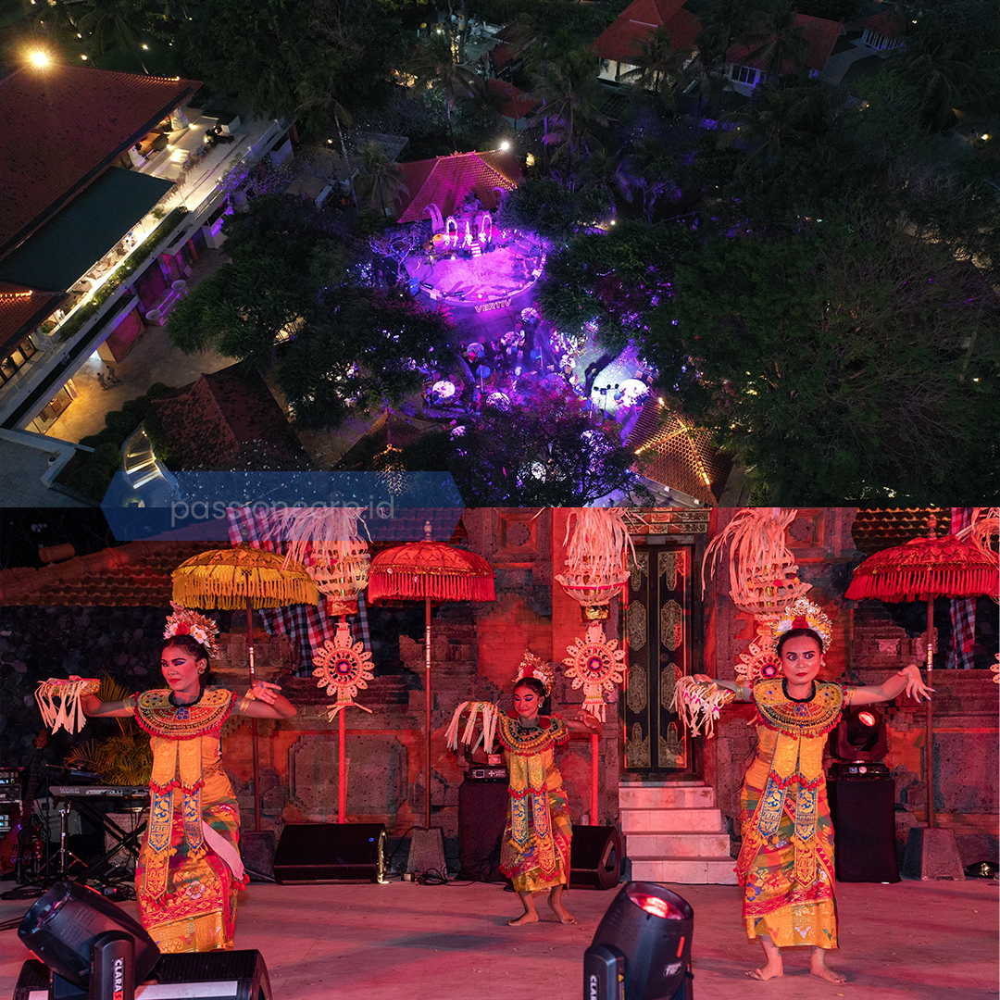
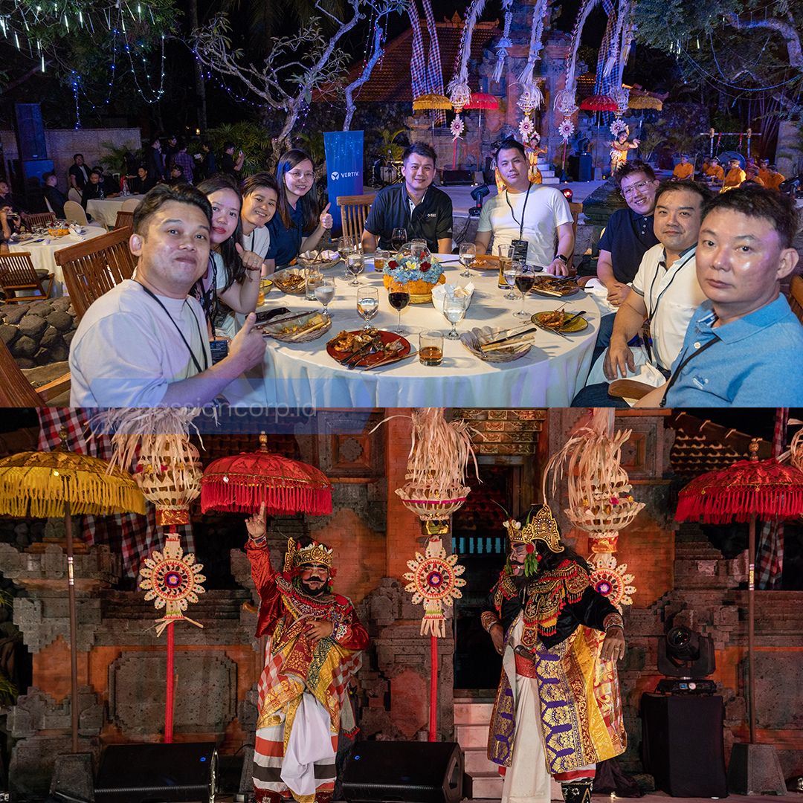
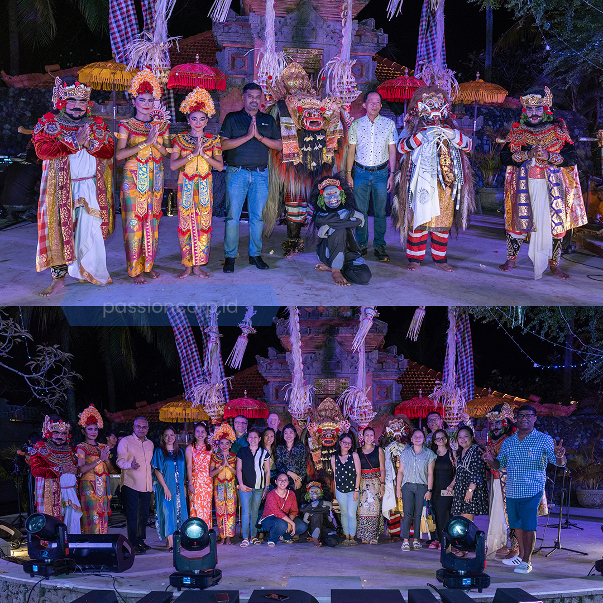

Mau acara kamu sukses besar? Tapi bingung gimana sih nyari EO yang berkualitas dan pas buat kamu. Yuk simak tips memilih EO yang sesuai buat kamu!

## Pengalaman dan Portfolio

Memeriksa pengalaman dan portofolio EO adalah langkah pertama yang wajib banget kamu lakuin. EO yang berpengalaman biasanya memiliki portofolio yang kuat yang mencerminkan kualitas kerja mereka. Kamu bisa meminta mereka untuk menunjukkan contoh acara sebelumnya yang sejenis dengan yang kamu rencanakan. Pengalaman yang kaya juga berarti EO tersebut sudah terbiasa menghadapi berbagai situasi dan tantangan yang mungkin muncul selama acara.

## Rekomendasi dan Ulasan

Mintalah rekomendasi dari teman, keluarga, atau orang-orang yang pernah menggunakan jasa EO tersebut. Ulasan dari klien sebelumnya juga bisa memberikan gambaran tentang kualitas layanan yang ditawarkan. Kamu bisa mencari ulasan online atau testimoni dari klien-klien sebelumnya. Rekomendasi dan ulasan yang positif biasanya menjadi tanda bahwa EO tersebut dapat dipercaya dan mampu memberikan layanan yang memuaskan.

## Layanan yang Ditawarkan

Pastikan EO yang kamu pilih menawarkan layanan yang sesuai dengan kebutuhan acara kamu. Beberapa EO mungkin spesialis di acara tertentu seperti wedding, konser, atau acara korporat. Pilih EO yang memiliki keahlian dan pengalaman dalam jenis acara yang kamu rencanakan. Jangan ragu untuk menanyakan layanan apa saja yang mereka tawarkan dan apakah mereka mampu memenuhi semua kebutuhan acara kamu.

## Komunikasi dan Kordinasi

Komunikasi yang baik adalah kunci dalam penyelenggaraan acara. Pilih EO yang responsif dan mudah diajak ngobrol. Mereka harus bisa menjelaskan semua detail
dengan jelas dan selalu terbuka untuk diskusi. Koordinasi yang baik antara EO dan klien bakal mastiin semua detail acara terpenuhi sesuai harapan kamu. Pastikan juga EO tersebut memiliki tim yang solid dan koordinasi internal yang baik, sehingga setiap anggota tim tahu perannya masing-masing.

## Harga

Sesuaikan harga layanan EO dengan anggaran yang kamu miliki. Ingat, harga yang lebih tinggi tidak selalu menjamin kualitas terbaik. Bandingkan harga dan layanan yang ditawarkan oleh beberapa EO untuk mendapatkan yang terbaik sesuai kebutuhan kamu. Pilih EO yang transparan dalam urusan biaya dan mampu memberikan penjelasan yang rinci mengenai apa aja yang masuk dalam harga tersebut. pastikan juga kualitas layanan yang diberikan sesuai dengan ekspektasi
kamu.

Dengan tips-tips di atas, kamu bisa dapetin EO yang berkualitas untuk acara kamu. Salah satu pilihan terbaik adalah Passion Corp Indonesia, yang menawarkan layanan berkualitas dengan harga terjangkau, mereka bakal memastikan acara kamu sukses tanpa perlu ngabisin kantong ! Passion Corp Indonesia adalah solusi tepat untuk acara yang berkualitas dengan budget yang bersahabat.