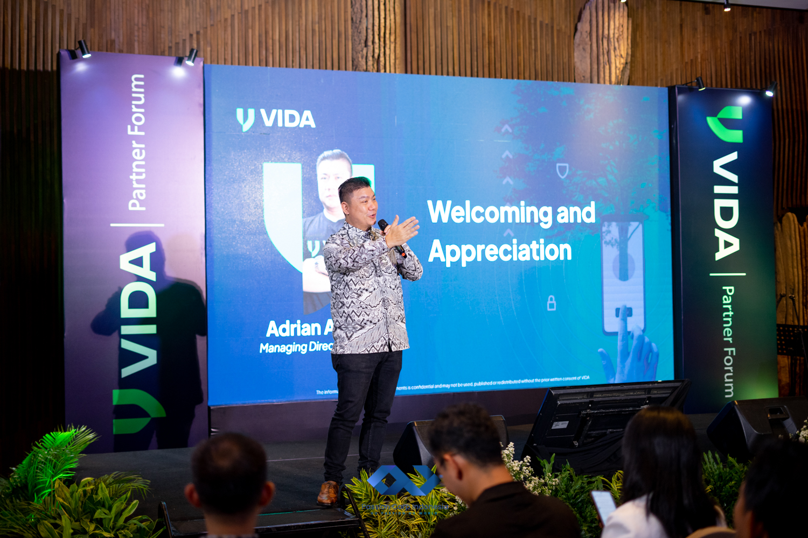
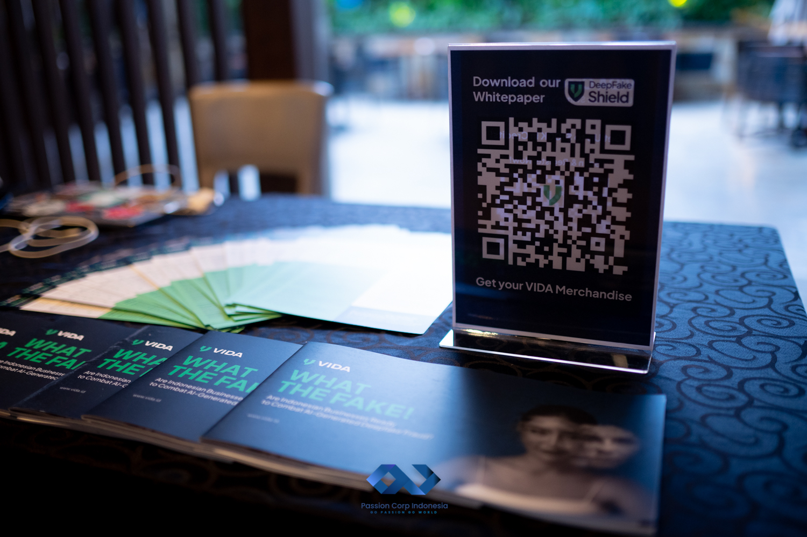

On June 12th, 2024, the VIDA Partner Forum 2024: Fostering Growth by Securing Identity took place at Rasa Restaurant, Hotel AYANA Midplaza, Jakarta, with the expertise of Passion Corp Indonesia as the event organizer. As a leading player in Indonesia's digital identity sector, VIDA hosted this forum to show appreciation to its trusted partners and share key business updates, future plans, and exciting product innovations.

At this forum, VIDA emphasized the importance of collaboration and maintaining strong relationships with partners. The event featured key topics including Milestone and Business Overview, an overview of the company's achievements and progress; New Partner Plan, focused on strategies to further strengthen partnerships; and Next Product Release, highlighting VIDA's latest innovations designed to meet the growing demand for secure digital identity solutions.

The VIDA Partner Forum 2024 stands out as a stellar example of how partner meetings can enhance business relationships and drive growth. With cyber security threats on the rise, protecting digital identities is now a top priority for organizations, making this forum both timely and crucial. VIDA’s commitment to providing secure digital identity solutions continues to set them apart as a leader in the industry, and this event allowed partners to get a closer look at their future vision.

The event was designed to be intimate, but with a warm and engaging atmosphere, allowing partners to share ideas and experiences. This type of setup is the future of partner meetings, where a focused environment can create more meaningful interactions and drive long-term business results.

## Passion Corp Indonesia’s Expertise in Event Organizing

At Passion Corp Indonesia, we are proud to have delivered a seamless experience for the VIDA Partner Forum 2024. Our team worked closely with VIDA to create an environment that not only facilitated important business discussions but also made the partners feel appreciated. From coordinating the logistics to ensuring the venue perfectly matched the event's tone, we provided end-to-end event management that made this occasion a resounding success.

Passion Corp Indonesia understands the unique demands of partner meetings, especially in the digital and tech industry, where innovation and trust are paramount. We ensure that every event we manage is tailored to our client’s specific goals while delivering an engaging and professional experience for their attendees.

## Elevating Your Event with Passion Corp Indonesia

Partner meetings, like the VIDA Partner Forum 2024, are not just a gathering—they are an opportunity to connect on a deeper level with stakeholders, showcase achievements, and outline future plans. These events require careful planning, attention to detail, and a strong understanding of the business’s goals. This is where Passion Corp Indonesia excels, making your events impactful, engaging, and professionally executed.

If you're planning your next partner meeting, seminar, or corporate event, trust us to help you deliver a remarkable experience that leaves a lasting impression. Contact Passion Corp Indonesia today to learn more about how we can bring your vision to life.

Looking to host a partner event like VIDA? [Get in touch](https://passioncorp.id/kontakWA?redirect=https%3A%2F%2Fwa.me%2F6282311000310%3Ftext%3DHi%252C%2520Passion%2520Corp%2520Indonesia%252C%2520I%2520know%2520you%2520from%2520website%2520https%253A%252F%252Fpassioncorp.id%252F) with Passion Corp Indonesia and let us make your next event meaningful and memorable!