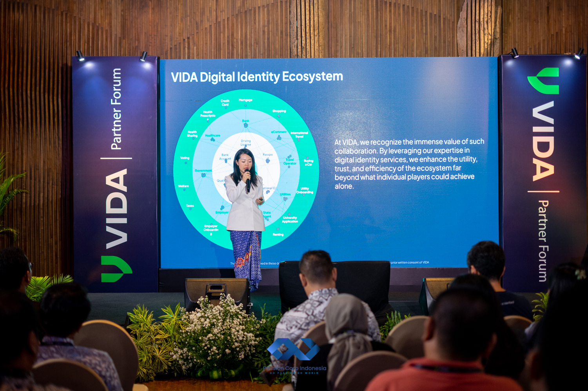
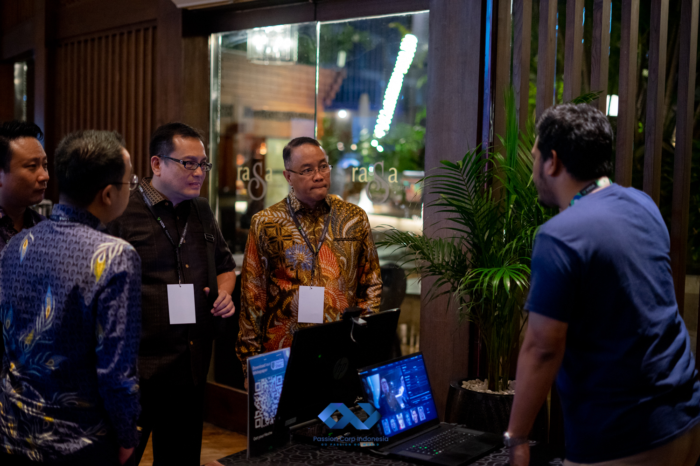

Passion Corp Indonesia had the honor of organizing the VIDA Partner Forum 2024: Fostering Growth by Securing Identity on June 12th, 2024, at the elegant Rasa Restaurant in Hotel AYANA Midplaza, Jakarta. This exclusive event brought together VIDA, Indonesia’s leading digital identity provider, and its valued partners, serving as both a networking platform and a show of appreciation to those who have collaborated with VIDA over the years.

The event was not just a time to reflect on partnerships; it was an opportunity to share cutting-edge innovations. VIDA is committed to elevating their solutions, enabling their partners to better serve clients by providing secure, reliable digital identity products in an era where data security has never been more crucial. As cyber threats continue to evolve, protecting personal and corporate identities is of the utmost importance.

The VIDA Partner Forum 2024 featured a lineup of prominent speakers who brought both vision and clarity to the conversation around digital identity and security. The discussions focused on how organizations today must not only embrace the digital transformation but also place significant emphasis on identity protection to prevent unauthorized access, identity theft, and other cybercrimes. As highlighted by VIDA’s leadership, securing private identities has become a vital aspect of business resilience.

## Passion Corp Indonesia’s Role

We at Passion Corp Indonesia are proud to have been chosen as the event organizer for this prestigious forum. From event concept to execution, our team worked closely with VIDA to ensure that the forum was not just another corporate event but a memorable and impactful gathering. The venue was carefully selected to provide a comfortable yet professional environment conducive to meaningful discussions, while our team ensured that every detail, from the technical setup to guest services, ran smoothly.

As the digital landscape evolves, so too must our approach to security. The VIDA Partner Forum 2024 underscored the importance of safeguarding identities in an age of increasing cyber threats, while also showcasing the innovative solutions VIDA continues to develop for the future. By focusing on the event’s core message—fostering growth through secure identity—we created an atmosphere where partners could engage, network, and walk away with new insights and strategies to protect their businesses and clients.

At Passion Corp Indonesia, we specialize in making events like these a success, creating the right environment for businesses to connect, collaborate, and grow. Interested in organizing a seamless, impactful event like VIDA’s Partner Forum? Get in touch with us today and discover how we can help bring your vision to life.

Want to know more about our services and partners? [Reach out to us](https://passioncorp.id/kontakWA?redirect=https%3A%2F%2Fwa.me%2F6282311000310%3Ftext%3DHi%252C%2520Passion%2520Corp%2520Indonesia%252C%2520I%2520know%2520you%2520from%2520website%2520https%253A%252F%252Fpassioncorp.id%252F) and let’s create something remarkable together!
