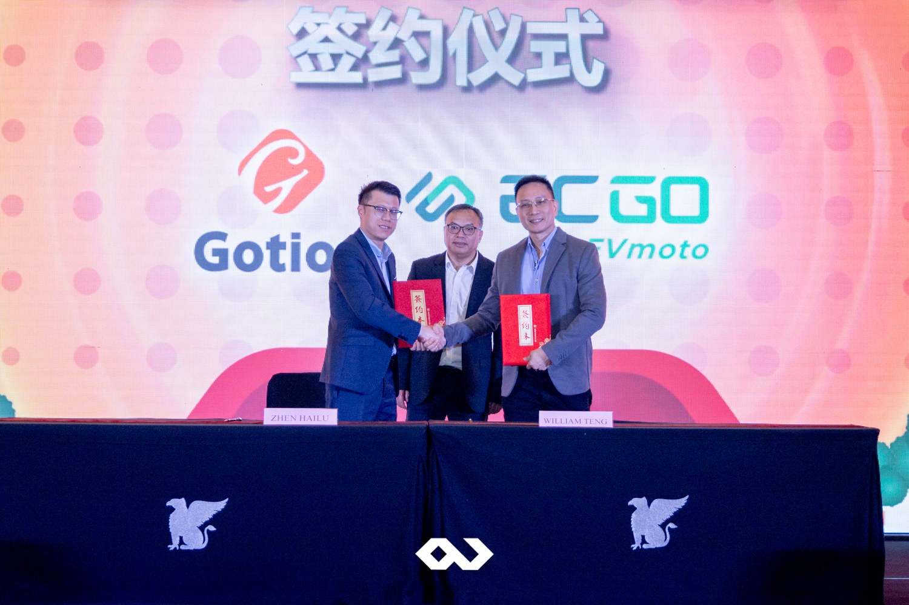

On July 26th, 2024, Gotion Indonesia, in collaboration with ICBC Bank, held an exclusive conference titled “Product and Services Promotion Conference” at JW Marriott Hotel Jakarta. The event brought together industry leaders, government officials, and experts in the electric vehicle (EV) sector to discuss the latest innovations and foster future collaborations. Passion Corp Indonesia was honored to be the official event organizer (EO) for this prestigious gathering, delivering seamless event execution for such an important occasion.

With the theme “Work Together To Forge Ahead And Win-Win Cooperation,” the event highlighted the commitment of various stakeholders to push forward the development of EV technology and infrastructure in Indonesia. The conference provided a valuable networking platform, allowing participants to engage in meaningful discussions and explore potential partnerships.

The event commenced with a keynote address by Mr. Moeldoko, Presidential Chief of Staff of Indonesia. His speech emphasized the significance of cooperation between government entities and private sectors to accelerate Indonesia’s transition toward green energy and the EV ecosystem. His words set the tone for a day of insightful presentations and collaborative discussions.

Key topics presented during the conference included a detailed overview of Gotion’s cutting-edge battery technologies, showcasing their potential to power the next generation of electric vehicles. Gotion Qingdao also focused on the advancements made by Gotion in the production of high-efficiency batteries in Qingdao, highlighting the company’s global expansion. Then, Green Power was addressing the crucial role of standardization in the EV industry to ensure seamless adoption and integration of battery swap systems. Lastly, the session from ICBC Bank provided an in-depth look into financial products tailored to support the growing electric vehicle industry in Indonesia.

In addition to the informative presentations, the conference included a signing ceremony between key companies operating in the electric vehicle space. This milestone signified a step toward forging stronger ties and fostering innovation in the EV sector, both locally and globally.

## Passion Corp Indonesia: Your Partner for Exceptional Event Management

As the event organizer, Passion Corp Indonesia ensured that every aspect of the conference was handled with precision and professionalism, from managing VIPs to coordinating the technical logistics of the event. Our team is dedicated to delivering excellence in all aspects of event management, whether it's a high-profile business conference, corporate gathering, or networking event.

The Gotion Indonesia and ICBC Bank: Product and Services Promotion Conference is a testament to our expertise in organizing large-scale events that bring together influential leaders from different industries.

With our extensive experience in the Meetings, Incentives, Conferences, and Exhibitions (MICE) industry, Passion Corp Indonesia is ready to assist in creating memorable, impactful events. Whether you're planning a product launch, an international conference, or a corporate retreat, our team will handle every detail to ensure success.

Let us elevate your next event! [Contact Passion Corp Indonesia today](https://passioncorp.id/kontakWA?redirect=https%3A%2F%2Fwa.me%2F6282311000310%3Ftext%3DHi%252C%2520Passion%2520Corp%2520Indonesia%252C%2520I%2520know%2520you%2520from%2520website%2520https%253A%252F%252Fpassioncorp.id%252F) and let us bring your vision to life.

