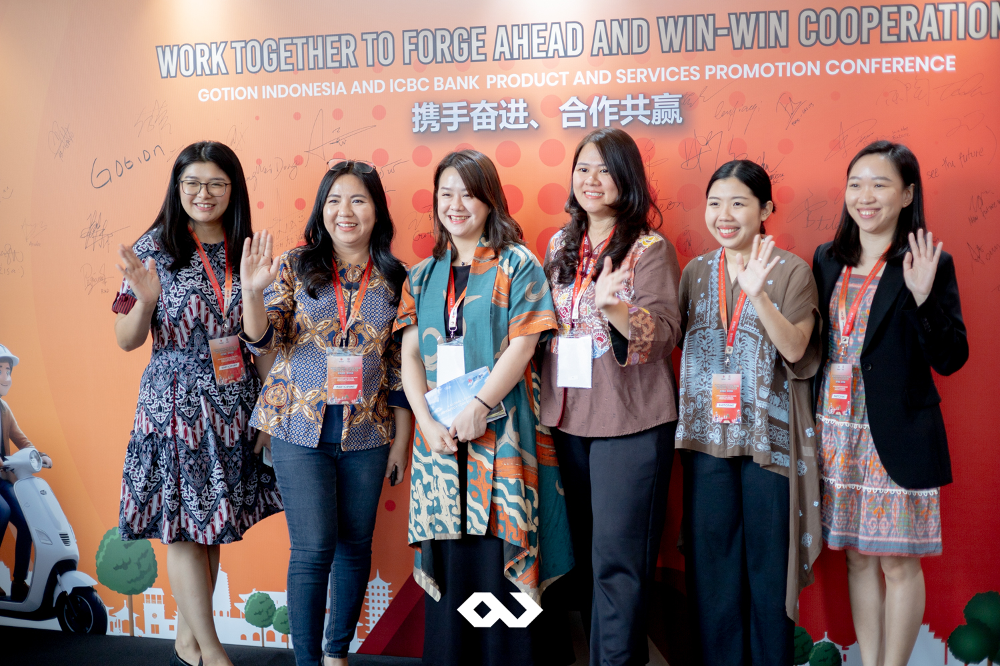

Gotion Indonesia and ICBC Bank hosted a landmark event at the prestigious JW Marriott Hotel Jakarta. This exclusive gathering, aimed at fostering collaboration in the electric vehicle (EV) industry, brought together companies and industry leaders under the theme “Work Together To Forge Ahead And Win-Win Cooperation.” Passion Corp Indonesia, a leading event organizer specializing in the MICE (Meetings, Incentives, Conferences, and Exhibitions) sector, proudly managed the event, ensuring every detail was handled with excellence.

The conference was conducted in both Indonesian and Mandarin, accommodating participants from various linguistic backgrounds. The event’s bilingual approach exemplified the growing cross-border cooperation between Indonesia and China, especially in sectors like EV technology and renewable energy. Leading the event was MC Fiona Yuan, a talented and experienced host who flawlessly navigated both languages throughout the day. Fiona’s ability to engage the audience in both Mandarin and Indonesian created an inclusive atmosphere, allowing all participants to fully engage with the content.

To enhance the networking experience, the round tables were set to facilitate comfortable situations, fostering open discussions among participants. This format encouraged collaboration, allowing guests to connect and share insights in a more personal and interactive environment, while the participants enjoyed a delightful buffet dinner. The luxurious 5-star catering from JW Marriott Hotel Jakarta lived up to its reputation, providing a range of gourmet dishes that perfectly complemented the high-profile nature of the event.

## Passion Corp Indonesia: Your Trusted MICE Event Organizer

Passion Corp’s young and talented team worked tirelessly to ensure the success of this high-profile event. Our expertise in organizing events in the MICE industry ensures that every event we manage is delivered to perfection. From managing bilingual presentations to handling VIP guests and arranging luxurious catering, Passion Corp Indonesia takes care of every detail.

Whether you’re planning an international conference, a corporate gathering, or a networking event, Passion Corp Indonesia is ready to exceed your expectations. Our team specializes in creating memorable experiences that cater to your specific needs, with attention to detail and professionalism at every stage.

[Contact us today](https://passioncorp.id/kontakWA?redirect=https%3A%2F%2Fwa.me%2F6282311000310%3Ftext%3DHi%252C%2520Passion%2520Corp%2520Indonesia%252C%2520I%2520know%2520you%2520from%2520website%2520https%253A%252F%252Fpassioncorp.id%252F) to start planning your next MICE event. Let us bring your vision to life with our exceptional event management services.
