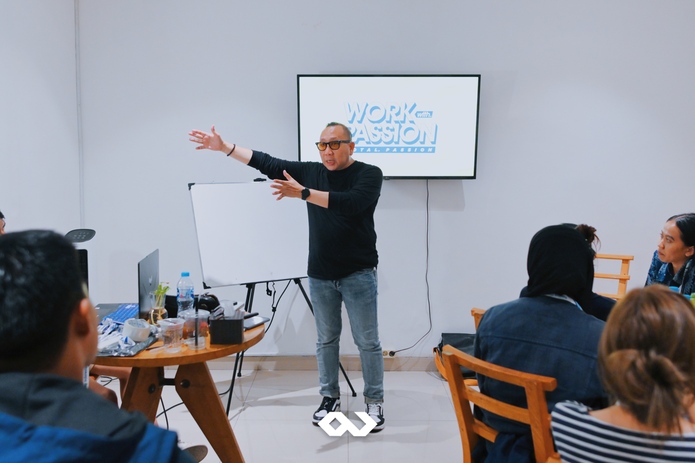
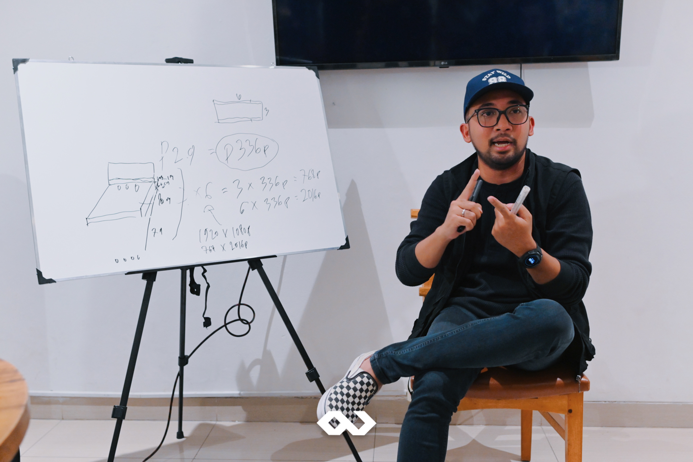

At Passion Corp Indonesia, we believe that the key to providing exceptional event services is continuous learning and development. On September 16th, 2024, we took another big step in honing our expertise by hosting a private training session called "Event Organizer 101" at the charming Cerita Coffee Tebet. This special event brought together more than 20 of our team members, each with diverse backgrounds, to dive deeper into event management and LED system technologies.

To guide us through this enriching experience, we had the pleasure of working with two renowned industry experts. Hary Awil, a seasoned event management specialist, shared his valuable insights on the intricacies of event production, coordination, and show management. Meanwhile, Ari Yudha, an LED system expert, introduced us to the latest trends in LED technology, giving us a sneak peek into the advanced tools we can use to elevate our event production game.

The training covered everything from managing complex event logistics to understanding the technical setup of LED systems—vital for creating memorable and dynamic event experiences. By equipping our team with these essential skills, we aim to provide even better service to our clients, ensuring that every event we organize is not just successful but also innovative and tailored to our clients’ needs.

What makes this training even more exciting is the wide range of backgrounds our participants brought to the table. From project managers to creative directors, everyone gained new knowledge and skills that will further strengthen our team. Our goal at Passion Corp is not just to organize events but to do so with precision, creativity, and forward-thinking strategies that meet the evolving demands of today’s market.

This effort underscores our vision: to grow, adapt, and always stay ahead of industry trends. By investing in training and development, we ensure that our team remains at the cutting edge of event management, equipped with the tools and expertise to make every event we handle a standout success.

At Passion Corp Indonesia, we are dedicated to learning and improving so that we can continue to provide top-notch event services. Whether you’re planning a corporate seminar, a high-profile conference, or a dazzling show, you can trust that our team is ready to make your event an unforgettable experience.

Curious to see how we can make your next event extraordinary? [Get in touch](https://passioncorp.id/kontakWA?redirect=https%3A%2F%2Fwa.me%2F6282311000310%3Ftext%3DHi%252C%2520Passion%2520Corp%2520Indonesia%252C%2520I%2520know%2520you%2520from%2520website%2520https%253A%252F%252Fpassioncorp.id%252F%2520%25E2%2580%259Cfree%2520consultation%25E2%2580%259D) with us at Passion Corp Indonesia and let’s create something unforgettable together!
