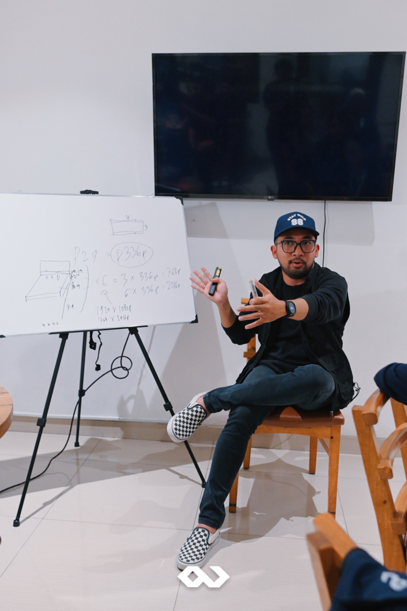
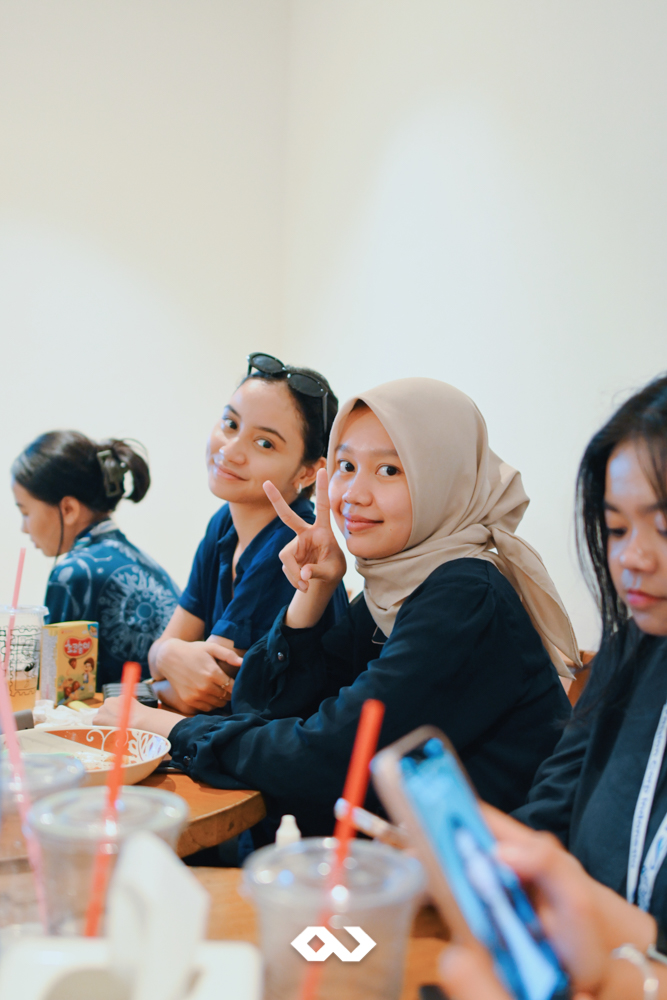

On September 16th, 2024, we organized an exclusive internal training session called "Event Organizer 101" at the cozy Cerita Coffee Tebet. This initiative was designed to not only refine our team's expertise but also to strengthen our shared commitment to professional growth and innovation. At Passion Corp Indonesia, we are committed to delivering exceptional event services—and that starts with continuous learning and development. 

We were fortunate to have two outstanding trainers lead this program: Hary Awil, an event management guru, and Ari Yudha, a leading expert in LED systems. Their guidance provided our team with a deep understanding of both the technical and managerial aspects of event production. Hary Awil took us through the core principles of successful event management, including planning, coordination, and show management, while Ari Yudha introduced us to cutting-edge LED technology, essential for creating captivating visual experiences.

This training wasn’t just about learning new skills—it was about becoming more professional as a team. By enhancing our expertise, we can serve our clients better, ensuring that every event we handle is executed with precision, creativity, and care. But beyond skill development, this program allowed our team to strengthen relationships with each other, building stronger ties that will help us work more effectively in the future.

At Passion Corp, our mission is clear: to provide high-quality event services that benefit our clients, partners, society, and the environment. We are a company that values innovation, quality, experience, and support, as outlined in our vision. By prioritizing continuous improvement, we ensure that each event is better than the last, staying in line with the latest trends in event management, production, and show management.

Our commitment to professional development is part of our broader corporate governance strategy. We believe in delivering more than just events—we deliver experiences. Every event we organize is tailored to meet the specific needs of our clients, ensuring success and leaving a lasting impression.

The Event Organizer 101 training program is just one example of how we put our vision into action. We invest in our team, so they are fully equipped to deliver the best results. Whether it's mastering event logistics or keeping up with the latest in LED technology, our goal is always the same: to provide top-notch service that exceeds expectations.

At Passion Corp Indonesia, we’re passionate about growth, innovation, and creating remarkable events. Our training programs ensure that we stay at the forefront of the event management industry, ready to tackle any challenge with confidence.

Want to know more about us? Visit our Instagram page [@passioncorp.id](https://www.instagram.com/passioncorp.id/) to see how we can bring your next event to life!
