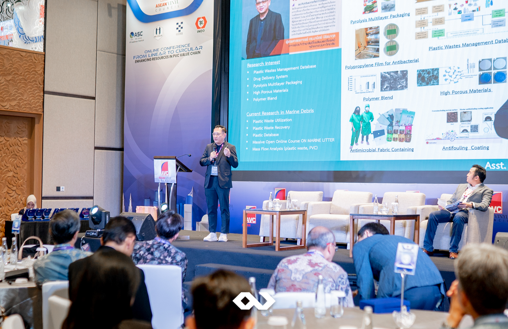

On September 12th, 2024, the ASEAN Vinyl Council (AVC) held its highly anticipated international conference, From Linear to Circular – Enhancing Resources in the PVC Value Chain, at Mövenpick Hotel Jakarta City Centre. This event, organized by Passion Corp Indonesia, brought together key stakeholders from various sectors, including representatives from the Ministry of Industry, academics, researchers, industry leaders, and recycling practitioners.

The primary goal of this conference was to raise awareness and deepen understanding of the PVC value chain, with a particular focus on the transition from a linear to a circular economy. By emphasizing sustainable practices, such as recycling and resource efficiency, this initiative aims to support government programs designed to enhance environmental sustainability in Indonesia.

## A Collaborative Effort to Drive Change

This conference aligned with national and international trends in circular economy practices and PVC recycling efforts. It provided a platform for productive dialogues between the government, AVC members, industry associations, recyclers, and other relevant stakeholders. By fostering these relationships, the event also contributed to strengthening ties between the PVC industry and government bodies in support of environmental regulations and sustainability targets.

The discussions underscored the importance of PVC recycling activities in Indonesia, showcasing how the value chain can contribute to national initiatives like reducing plastic waste and supporting the green economy. AVC members, including resin producers and additives suppliers, shared their self-imposed sustainability initiatives to ensure their operations align with circular economy principles.

## Passion Corp Indonesia: Delivering Excellence in Event Management

As the event organizer, Passion Corp Indonesia ensured the seamless execution of the conference, offering a full range of services, including logistics, equipment management, documentation, and live streaming. Given the hybrid nature of the event, which catered to both in-person and online audiences, we provided the necessary manpower and technical expertise to deliver a professional experience for all attendees.

With our specialized experience in MICE (Meetings, Incentives, Conferences, and Exhibitions) events, we ensured every aspect of the conference was handled with precision and efficiency. This allowed the AVC and its members to focus on their goals: raising awareness, promoting sustainable practices, and driving forward the transition to a circular economy in the PVC value chain.

## Shaping the Future of Sustainability

The ASEAN Vinyl Council International Conference was more than just an industry event—it was a pivotal moment in promoting sustainable development within the PVC industry. By gathering key stakeholders and fostering dialogue around the importance of circular economy practices, this event helped to shift perceptions and encourage further commitment to recycling and sustainability in Indonesia.

At Passion Corp Indonesia, we take pride in contributing to meaningful events that drive positive change. To learn more about how we can support your next event with our comprehensive MICE services, visit our website or contact us today.

For more information about Passion Corp Indonesia’s event services, click [here](https://passioncorp.id/pricing/).
