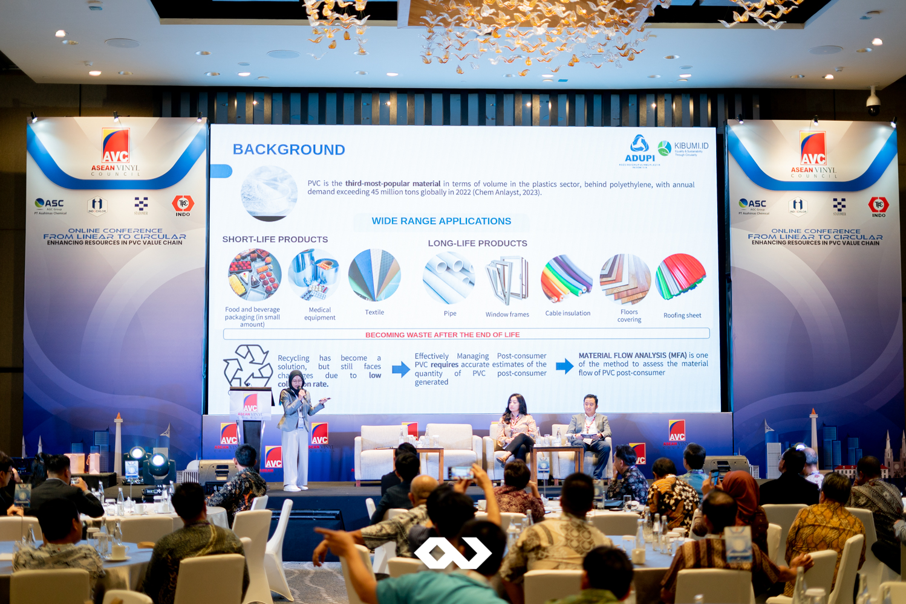

The ASEAN Vinyl Council (AVC) successfully hosted the AVC International Conference: From Linear to Circular – Enhancing Resources in the PVC Value Chain at Mövenpick Hotel Jakarta City Centre. This highly anticipated event, organized by Passion Corp Indonesia, brought together international participants to discuss key aspects of the circular economy, with a special focus on the PVC industry’s role in sustainability.

The event featured presentations addressing essential topics such as the role of PVC in sustainability, government regulations related to the circular economy, collaborative efforts between organizations, and innovations in PVC recycling technologies. This forum not only provided an opportunity to delve into the technical and regulatory aspects of the PVC value chain but also fostered connections among participants, making it a valuable networking platform for industry leaders, researchers, recyclers, and government officials.

The overarching theme of the conference, From Linear to Circular – Enhancing Resources in the PVC Value Chain, was divided into several important sub-themes. And beyond the educational aspect, this conference served as a premier networking opportunity for all attendees. Leaders from various sectors were able to exchange ideas, form partnerships, and explore new avenues of collaboration to advance sustainability goals.

Passion Corp Indonesia, as the event organizer on behalf of AVC, took pride in ensuring the smooth execution of both the conference and the networking sessions. Our team provided comprehensive event management services, including logistics, documentation, equipment, and live streaming support. Given the international nature of the event, our bilingual manpower (Indonesian and English-speaking) ensured that participants from diverse backgrounds could engage seamlessly, eliminating any potential language barriers.

## Passion Corp Indonesia: Your Trusted Partner for International Events

As an experienced MICE (Meetings, Incentives, Conferences, and Exhibitions) event organizer, Passion Corp Indonesia is committed to delivering high-quality services for both local and international events. We were honored to support AVC in hosting this important conference, ensuring that every detail was meticulously planned and executed.

With our bilingual expertise and proven track record, we’re equipped to assist organizations in hosting successful events on any scale. Whether it’s a national conference or an international seminar, Passion Corp Indonesia is your go-to partner for professional event management.

Follow us on Instagram [@passioncorp.id](https://www.instagram.com/passioncorp.id/) for more information on how we can make your next event a success!
